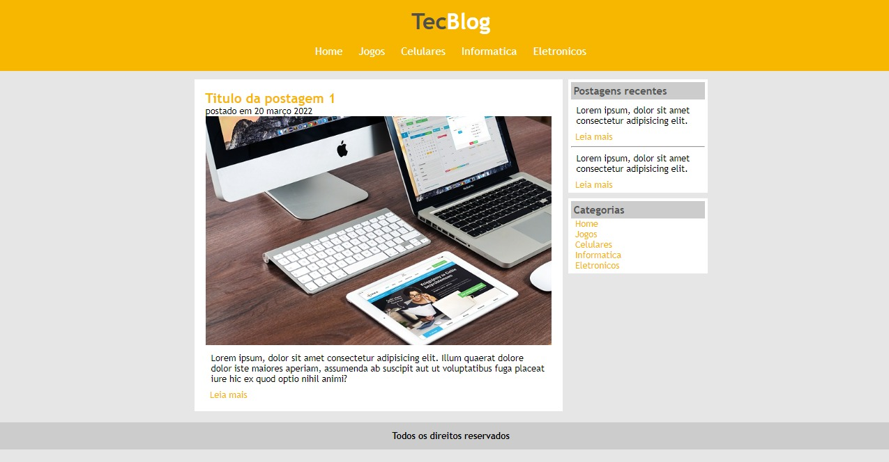

# Projeto Tec Blog
Projeto de site de Notícias utilizando HTML e CSS: Desenvolvimento Web Completo 2022 - 20 cursos + 20 projetos - Udemy

### Como inicar o projeto: 

- Basta baixar o código em formato zip.
- abrir o arquivo index.html em seu navegador de preferência.   

## Tecnologias e Dependências

| Name | Link |
| ------ | ------ |
| HTML5 | [https://www.w3schools.com/html/] |
| CSS | [https://www.w3schools.com/css/] |

